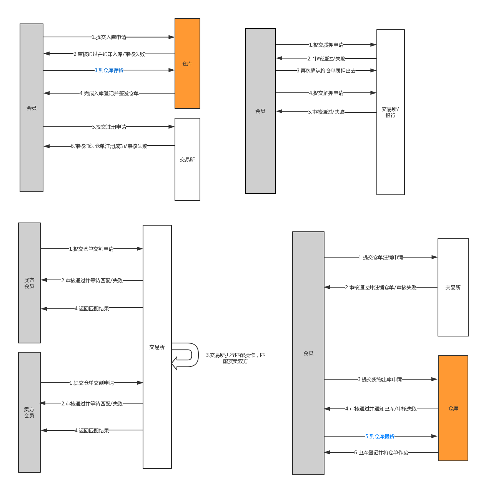

 # Bulk Chain 平台操作手册

## 引言

### 编写目的
本文档根据软件需求说明以及已编写完整的程序，旨在充分叙述本网站所能实现的功能及其运行环境，为系统使用者提供一个良好的入门手册。为后台管理人员以及维护人员维护本网站提供指导与帮助说明，为制作客户使用说明书提供依据。

### 项目概况
Bulk Chain 为基于区块链的农产品仓单系统。

区块链是一种新型去中心化协议，能安全地储存数据，信息不可伪造和篡改，可以自动执行智能合约，无需任何中心化机构的审核。

该仓单交易平台以实行标准化电子交易为目标，通过制定相适应的交易规则，完成开户、交易、结算、交割 等仓单业务，增加供应链效率，减少交易风险，提高服务质量。

Bulk Chain 的主要特点为:
- 数据透明提高交易可见度
- 数据不可篡改保障交易安全性
- 去中心化的高效智能合约

Bulk Chain 面向各大交易所大宗农产品仓单交易，在系统上可进行仓单登记、仓单审核、
仓单注销、仓单交易等，仓单从生成到注销所有状态变更的过程，都会自动写入数据库。利用区块链技术加强供应链的跟踪和自动化，将大宗农产品供应链数字化的货物流、资金流和信息流，分布式地存储在云端，并由交易各方平权共享。让交易可溯源、透明度高、风险低、 安全可靠。

## 系统介绍

### 系统功能

  

### 声明
1. 不在用户PC端安装任何插件或强制用户安装任何插件；
2. 软件将不会对用户电脑造成损害；
3. 软件将不会出现恶意代码对用户信息进行篡改。

## 会员用户操作

### 登录
在本网站中，主要功能及某些功能需要用户登录才可以使用。只有用户登录之后，才可以看到这些功能。网站功能对不同用户身份有区分，用户登录后网站会识别用户身份，呈现不同功能。

### 主页
用户登录后进入主页，主页显示用户身份，用户可退出登录。

用户可通过左侧侧边栏打开不同的业务界面。

### 申请仓单
在申请仓单页面，会员用户可看到申请仓单历史列表。

可填写入库申请。

提交申请后，相应的仓库收到申请时能够看到以上申请信息，并填写相应的审核信息。会员可随时查看申请详情。

如果申请通过，会员需要前往仓库入库，仓库将对入库信息进行登记。

仓库对货物的数量和质量等信息进行核对并完成入库登记后，系统生成相应的仓单。

### 我的仓单

在我的仓单页面，会员用户可查看持有仓单的相关信息，可通过表头排序或筛选指定字段。

  

可对不同状态的仓单进行特定的操作，操作流程与申请仓单类似。

### 我的客户
我的客户页面列举了会员的客户。

## 交易所、仓库、银行用户操作
虽然不同用户的业务和功能不同，但在内容呈现和操作上与会员用户类似，这里不再赘述。

