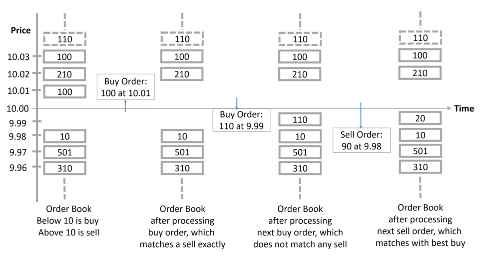
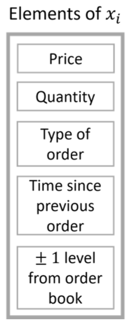
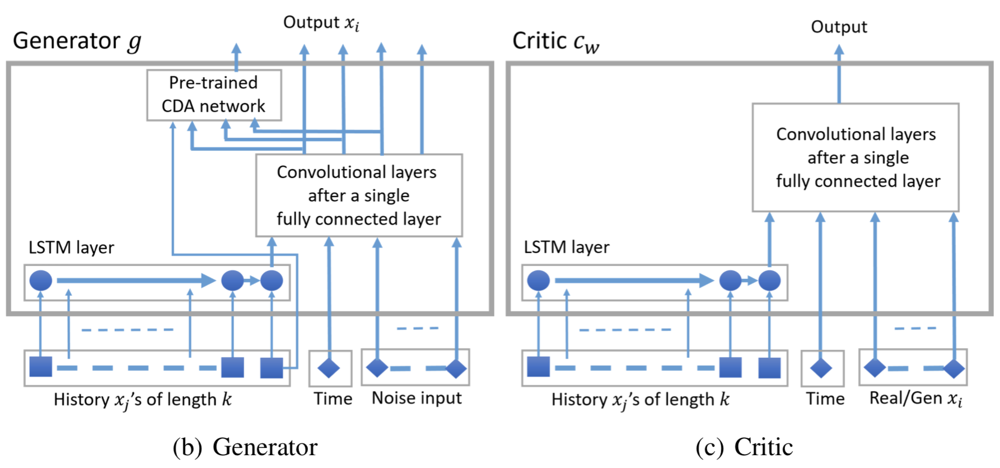
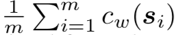
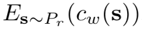
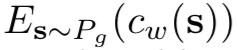
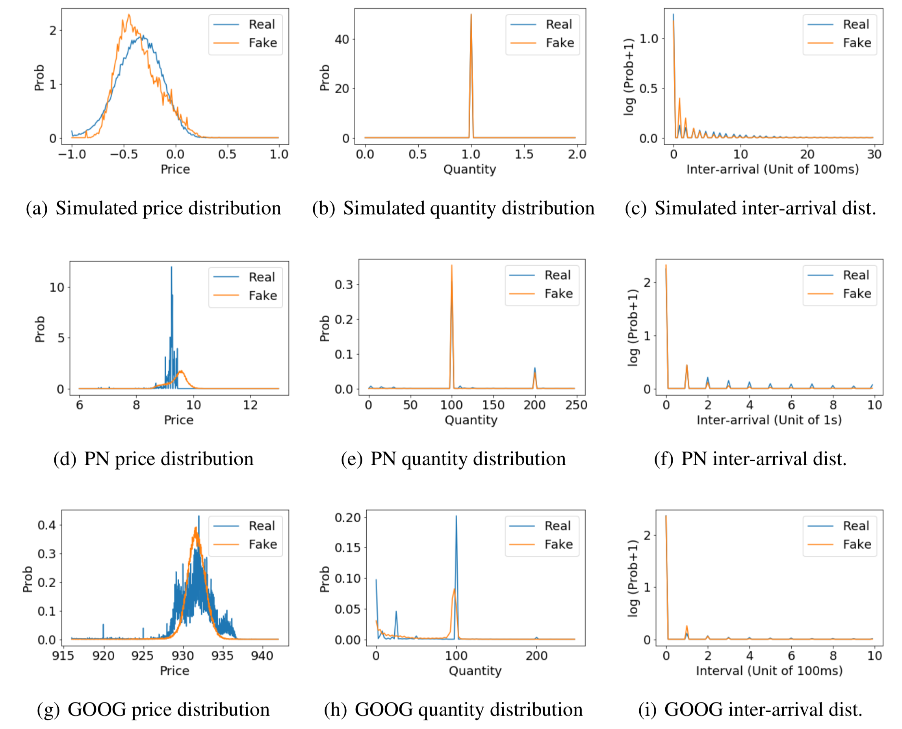
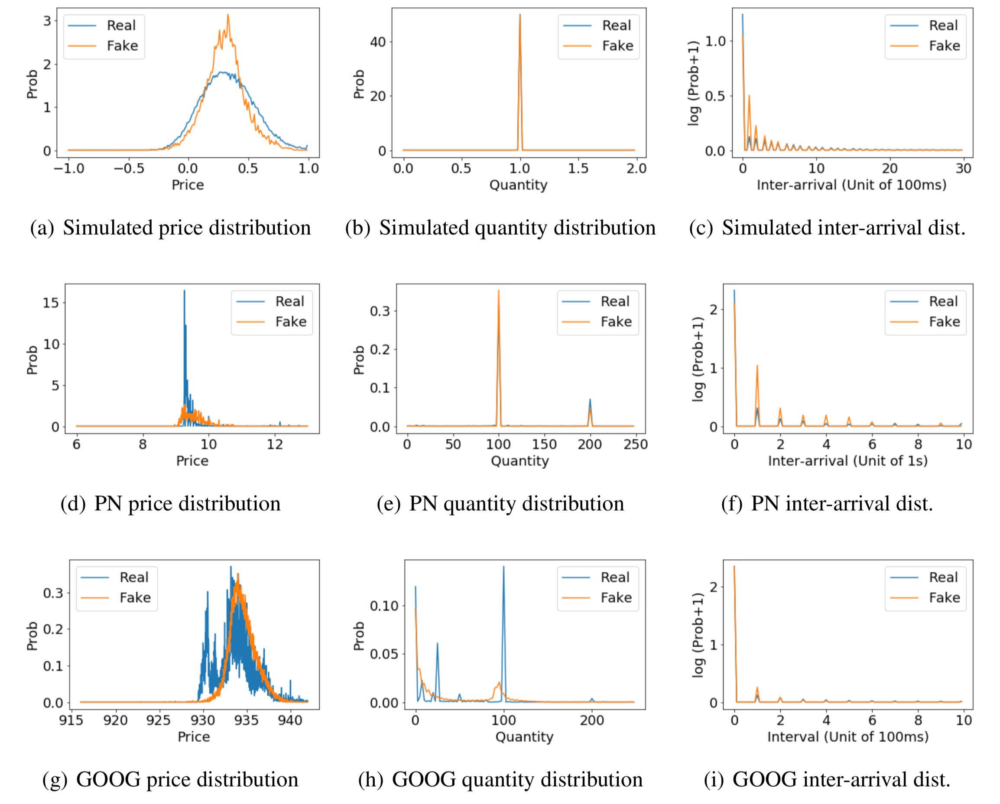
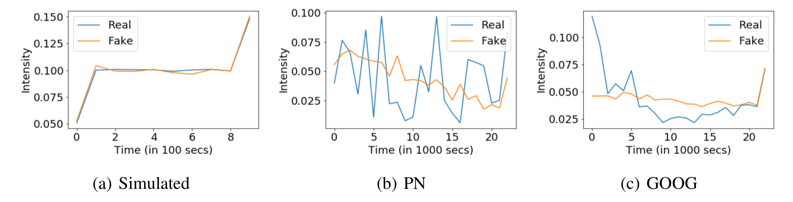
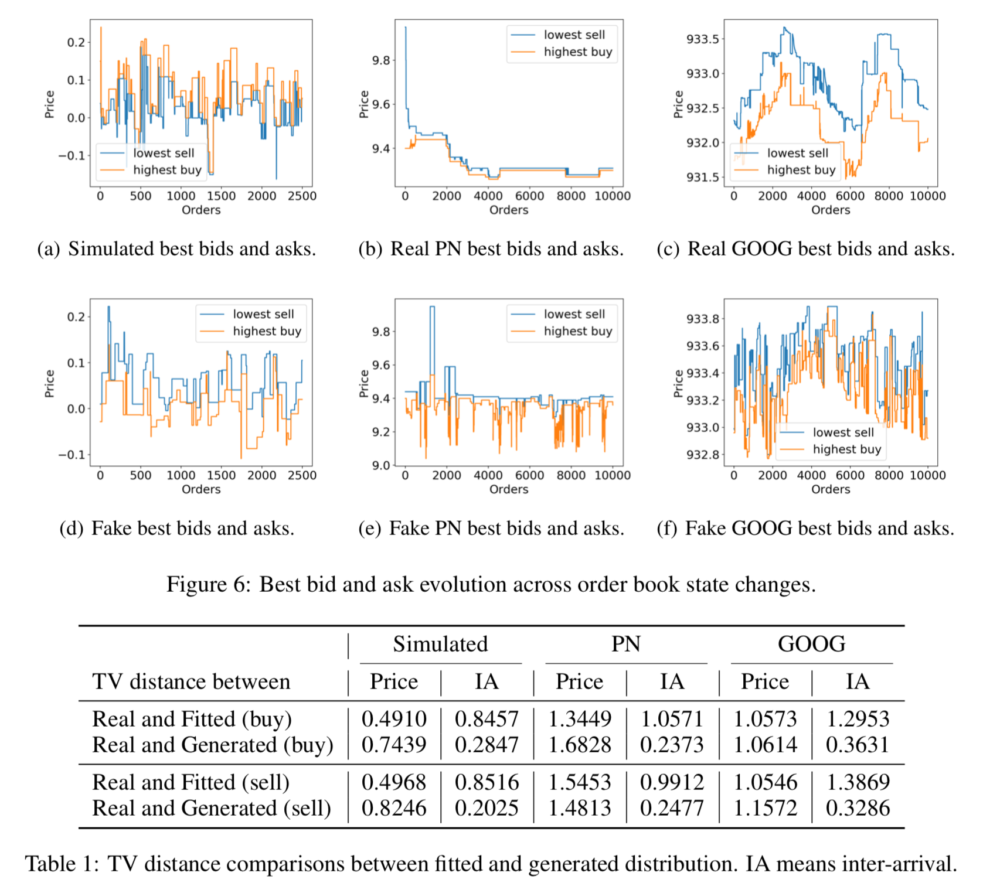

# GENERATING REALISTIC STOCK MARKET ORDER STREAMS
https://openreview.net/pdf?id=rke41hC5Km
- model the order stream as a **stochastic process** with finite history dependence
- employ a **conditional Wasserstein GAN** to capture history dependence

## INTRODUCTION
- **Agent-based** models accommodate greater dynamic complexity, and are often able to reproduce “stylized facts” of real-world markets (LeBaron, 2006).
- Currently lacking, however, is a simulation capable of producing market data at **high fidelity and high realism**.
- Our main contribution is an approach to produce stock market data that is close to real market data, using a **Wasserstein generative adversarial network (WGAN)** (Arjovsky et al., 2017).
- assume the stock market data stream to arise from a stochastic process with finite (but long) memory dependence. The stochastic process view also makes precise the **conditional distribution** that the generator is learning as well the **joint distribution** that the critic of the WGAN distinguishes by estimating the **earth-mover distance**.

## RELATED WORK AND BACKGROUND
- Most prior work on generation of sequences using GANs has been in the domain of text generation. However, since the space of word representations is not continuous, the semantics change with nearby word representation, and given a lack of agreement on the metrics for measuring goodness of sentences, producing good quality text using GANs is still an active area of research.
- Our problem is richer as we aim to generate the actual limit orders including **time, order type, price, and quantity information**.
- our goal is not market prediction per se, but rather **market modeling**
- stock markets follow the **continuous double auction (CDA) mechanism**

- The order book is often approximated by few (e.g., ten) **price levels** above the best bid and ten price levels below the best ask; as these prices are typically the ones that dictate the transactions in the market.
- We aim to generate orders for a security in **aggregate** (not per agent) that is close to the aggregate orders generated in a real market. We focus on **generating orders and do not attempt to generate transactions** in the stock market.
## STOCK-GAN
### STOCK MARKET ORDERS AS A STOCHASTIC PROCESS
- a stochastic process is a collection of random variables indexed by a set of numbers
- We view the stock market orders for a given chunk of time of day ∆t as acollection of vector valued random variable{xi}i∈N indexedbythelimitorder sequence number in N = {1, . . . , n}. The components of the random vector xi include the time interval di, type of order ti, limit order price pi, limit order quantity qi, and the best bid ai and best ask bi. The time interval di specifies the difference in time between the current order i and previous order i − 1 (in precision of milliseconds); the range of di is finite. The type of order can be buy, sell, cancel buy, or cancel sell (represented in two bits).

       

- we assume the stochastic process depends on the discrete time of day ∆t, which we will make explicit in the next paragraph. We divide the time in a day into 25 equal intervals and ∆t refers to the index of the interval.
- We assume a finite history dependence of the current output xi, that is, P(xi | xi−1, . . . , ∆t) = P (xi | xi−1, . . . , xi−m, ∆t)
- this process is a higher order Markov chain
- P (xi , . . . , xi−m+1 | ∆t) has the same distribution for any i, assume a larger history length k + 1 > m. We choose k = 20
### WGAN ARCHITECTURE AND WORKING
- learn the real conditional distribution P_r(xi |xi−1,...,xi−k,∆t)
- Our data points for training are sequences xi,...xi−k
#### Architecture

- The history is condensed to one vector using a single LSTM layer
- This vector and some uniform noise is fed to a fully connected layer layer followed by a **convolutional** structure.
- The generator outputs **the next xi** (realization of xi) and the critic outputs **one real number**.
- when **training** both generator and critic are **fed history from real data**, but when the generator **executes** after training it is **fed its own generated data** as history
- the best bid and ask can be inferred deterministically from the current order and the previous best bid and ask (for most orders), we use another neural network (with frozen weights during GAN training). We call this the **CDA network**. 
- The CDA network is trained separately using a standard regression **MSE loss**.
#### Critic details
- a function cw of si = (xi,...,xi−k,∆t), where w are the weights of the critic network
- m samples fed to the critic,  estimates 
- fed generated data m i=1
 (with the ten price levels determined from the output order and previous ten levels),   estimates  
- computes the Wasserstein distance between the joint
distributionsPr(xi,...,xi−k,∆t)andPg(xi,...,xi−k,∆t)
- we use a **gradient penalty** term in the loss function for the critic instead of clipping weights as proposed in the original WGAN
-  The critic is trained 100 times in each iteration
#### Generator details
- learns the conditional distribution Pg (xi | xi−1 , . . . , xi−k , ∆t)
- Along with the real history,the generator represents the distribution Pg(xi,...,xi−k,∆t)=Pg(xi | xi−1, . . . , xi−k, ∆t)Pr(xi−1, . . . , xi−k, ∆t)
## EXPERIMENTAL RESULTS
- compare key metrics and distributions of our generated orders with ground truth orders from the **agent-based simulator and real stock markets**
### SYNTHETIC AND REAL DATA
#### Synthetic data
- Agents enter and reenter the market according to a Poisson process with an arrival rate of 0.005.
- The market environment is populated by 32 traders, representing investors.
- 300,000 orders
- The price output by the simulator is normalized to lie in the interval [−1, 1]
#### Real data
- Since our interest is primarily on behavior that can affect market outcomes, we focus on limit orders in the relevant range near the best bid and ask. 
- Specifically, in a preprocessing step, we **eliminate limit orders that never appear within ten levels of the best bid and ask prices**.
- PN 20,000 orders and GOOG about 230,000.
### EVALUATION STATISTICS
1. **Price**. Distribution over price for the day’s limit orders, by order type.
2. **Quantity**. Distribution over quantity for the day’s limit orders, by order type.
3. **Inter-arrival time**. Distribution over inter-arrival durations for the day’s limit orders, by order type.
4. **Intensity evolution**. Number of orders for consecutive 1000-second chunks of time.
5. **Best bid/ask evolution**. Changes in the best bid and ask over time as new orders arrive.

- In our generation process, cancellation type orders are not contingent on the order book. We use a **heuristic** which is to match the generated cancellation order to the closest priced order in the book. Cancellations that are too far from any existing order to be a plausible match are ignored.
### RESULTS
- Simulated, PN, and GOOG submitted buy-order statistics

- Simulated, PN, and GOOG submitted sell-order statistics

- Intensity of market activities that include all types of orders across the trading period

